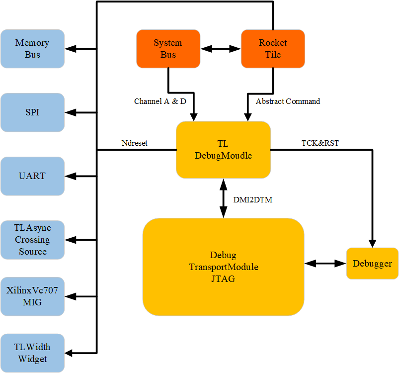
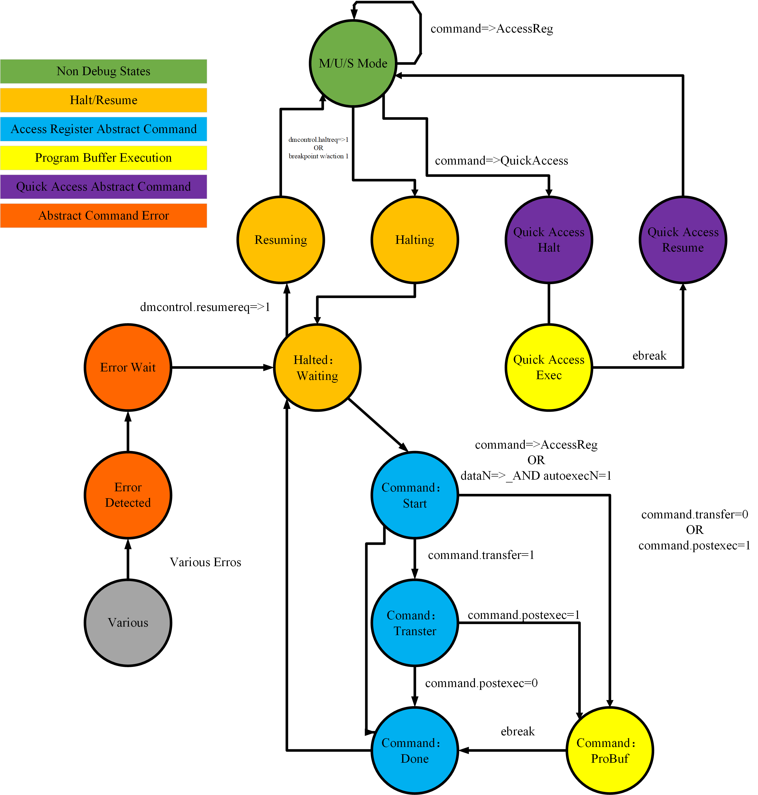

# 2.5 JTAG  
## 2.5.1 JTAG Technical Specification    

### Description    
JTAG (Joint Test Action Group), an international standard testing protocol conforming to IEEE 1149.1, is primarily used for internal chip testing. Many advanced devices, such as DSPs and FPGAs, support the JTAG protocol. The standard JTAG interface comprises four lines: TMS, TCK, TDI, and TDO, representing Mode Select, Clock, Data Input, and Data Output, respectively.

Initially designed for chip testing, JTAG operates by defining a TAP (Test Access Port) within the device, allowing internal nodes to be tested using dedicated JTAG tools. JTAG's unique capability enables multiple devices to be daisy-chained via the JTAG interface, forming a JTAG chain that facilitates individual device testing. Beyond testing, the JTAG interface is also commonly utilized for In-System Programming (ISP), enabling programming of components like FLASH memory.

JTAG's in-system programming approach revolutionizes traditional production flows, where chips were pre-programmed before being soldered onto boards. This method simplifies the process by allowing devices to be secured onto the board first, followed by JTAG programming, significantly accelerating project timelines. The JTAG interface can program all components within a PSD (Programmable System Device) chip.  
## 2.5.2 Theory of Operation     
### 2.5.2.1 Module Structure  
**MEISHAV100 DM and JTAG Connection Diagram**

The DM and JTAG connection diagram for MEISHAV100 is as follows:
<div align=center>  

  
DM and JTAG Connection
<div>
<div align=left><div>   

Since the project is generated by Chisel, the modules used are in accordance with the specifications of SiFive and UC Berkeley.

Here, the TLDebugModule uses the Debug design from Rocket-Chip. The file location is:

```shell
:/src/main/scala/device/debug
|- Debug.scala
```

The DebugTransportModuleJTAG uses the design from the following location:

```shell
:/src/main/scala/device/debug
|- DebugTransport.scala
:/src/main/scala/JtagTap.scala
|- JtagTap.scala
|- JtagShifter.scala
|- JtagStateMachine.scala
```

#### 2.5.2.1.1 top_module: TLDebugModule (slave)

- **TLDebugModuleOuterAsync**
    - DMIToTL
    - TLXbar_7
    - TLDebugModuleOuter
    - IntSyncCrossingSource
    - TLAsyncCrossingSource
    - AsyncQueueSource_1
- **TLDebugModuleInnerAsync**
    - TLDebugModuleInner
    - TLAsyncCrossingSink
    - AsyncQueueSink_1
    - AsyncQueueSource_2
    - AsyncQueueSink_2
    - ResetCatchAndSync_d3

#### 2.5.2.1.2 top_module: DebugTransportModuleJTAG (master's interface)

- CaptureUpdateChain (as dtmInfoChain)
- CaptureUpdateChain_1 (as dtmAccessChain)
- CaptureChain (as idcodeChain)
- JtagTapController
    - JtagStateMachine
    - CaptureUpdateChain_2 (as irChain)
- JtagBypassChain

Overall, only DR Bypass and IR are implemented, which is not related to verification.

For reference, the Rocket-Chip project can be found at: [https://github.com/chipsalliance/rocket-chip/tree/master](https://github.com/chipsalliance/rocket-chip/tree/master).


### 2.5.2.2 JTAG TAPC State Machine  
The JTAG controller incorporates the standard TAPC state machine as depicted below, with the state machine handling clocking via TCK.
  
<div align=center>
    
  
JTAG Controller
<div>
<div align=left><div>  

### 2.5.2.3  Resetting JTAG Logic
Asynchronous reset of the JTAG logic must be achieved by asserting the power-on-reset signal, which drives an internal jtag_reset signal.

Asserting jtag_reset will reset both the JTAG DTM and the debug module test logic. Since certain debug logic requires a synchronous reset, the jtag_reset signal is internally synchronized within the FU540-C000.

During operation, the JTAG DTM logic can also be reset without involving jtag_reset by asserting jtag_TMS while issuing five jtag_TCK clock ticks. This operation only resets the JTAG DTM, not the debug module.

### 2.4.2.4 JTAG Clocking
The JTAG logic always operates within its own clock domain, which is clocked by jtag_TCK. The JTAG logic is fully static and has no minimum clock frequency requirement. The maximum jtag_TCK frequency is part-specific.
### 2.4.2.5 JTAG Standard Instructions

The JTAG DTM implements the BYPASS and IDCODE instructions.
The IDCODE for the FU540-C000 is set to 0x20000913.

### 2.4.2.6 JTAG Debug Commands

The JTAG DEBUG instruction accesses the SiFive debug module by connecting the debug scan register between jtag_TDI and jtag_TDO.

### 2.4.2.7 Overview of States

A conceptual view is provided of the states a hart transitions through during run/halt debugging, which are influenced by various fields in dmcontrol, abstractcs, abstractauto, and command.     
  

<div align=center>




<div>
<div align=left><div>   

## 2.5.3 JTAG Design Verification         
**Goals**     

Verify JTAG IP features by running dynamic simulations with a SV/UVM based testbench  

**Design features**    

For detailed information on JTAG design features, please see the **JTAG Technical Specification**.   

**Testbench architecture**  

Top level testbench is located at /trunk/hw/d2dv100_top/dv/dut_MEISHAV100_TOP_wrapper.sv. It instantiates the TOP DUT module /trunk/hw/d2dv100_top/rtl/top/MEISHAV100_TOP.sv. In addition, it instantiates the following interfaces, connects them to the DUT and sets their handle into `uvm_config_db`:  
+  Clock and reset interface  
+  Tilelink host interface  
+  JTAG IOs   
   
**Global types & methods**  

All common types and methods defined at the package level can be found in `JTAG_env_pkg`   

**TL_agent**   

JTAG Device instantiates `tl_agent` which provides the ability to drive and independently monitor random traffic via TL host interface into JTAG Device.  

**JTAG_agent**  

`JTAG agent` is used to drive and monitor JTAG items.  

### 2.5.3.1 Testplan
#### 2.5.3.1.1 Allocate resources, initialize member variables.

```systemverilog
function new(string name, uvm_component parent);
        super.new(name, parent);
        set_type_override_by_type(dv_lib_pkg::dv_base_env_cfg#(tlul_base_env_pkg::tlul_base_reg_block)::get_type(), `tc_name_cfg::get_type());
        set_type_override_by_type(tlul_base_env_cfg::get_type(), `tc_name_cfg::get_type());
        cfg = `tc_name_cfg::type_id::create("test_cfg", this);
        jtag_base_env = jtag_env_pkg::jtag_env::type_id::create("jtag_base_env", this);
        dr_seq = new("dr_seq");
        dmstatus = new("dmstatus");
        dtmcs = new("dtmcs");
        dmcontrol = new("dmcontrol");        
        dmabstractcs = new("dmabstractcs");
        ////uart_base_env = uart_env::type_id::create("uart_base_env", this);
        ////set_type_override_by_type(dv_base_scoreboard#(dv_base_reg_pkg::dv_base_reg_block,dv_base_env_cfg,dv_base_env_cov)::get_type(), spi_scoreboard::get_type());
    endfunction //new()


```
#### 2.5.3.1.2 read_id_code(Reading IDCODE instruction)

```systemverilog
virtual task read_id_code();
    this.dr_seq.send_ir(this.jtag_base_env.m_jtag_agent.sequencer, 5, DTM_IDCODE);
    this.dr_seq.send_dr(this.jtag_base_env.m_jtag_agent.sequencer, 32, {32'h0000_0000});  // randomize value  IDCODE WIDTH is 32
    if(32'h20000913 != this.dr_seq.rsp.dout[31:0]) begin
        `uvm_error("read_id_code", $sformatf("%h not expect", this.dr_seq.rsp.dout))
    end
endtask


```

#### 2.5.3.1.3 read_dtmcs(Reading the DTM status)


```systemverilog
virtual task read_dtmcs();
automatic int unsigned data_array[];
automatic bit [6:0] abits = `DTM_ABITS;
automatic bit [2:0] idle = `DTM_IDLE_DELAY_CYCLE;
this.dr_seq.send_ir(this.jtag_base_env.m_jtag_agent.sequencer, 5, DTM_DTMCS);
this.dr_seq.send_dr(this.jtag_base_env.m_jtag_agent.sequencer, 32, {32'h0000_0000});  // randomize value  IDCODE WIDTH is 32
if({14'h0, 1'b0, 1'b0, 1'b0, idle[2:0], 2'b0, abits[5:0], 4'b1} != this.dr_seq.rsp.dout[31:0]) begin
    `uvm_error("read_dtmcs", $sformatf("%h not expect", this.dr_seq.rsp.dout))
end
// data_array = new[4];
// for ( int i = 0; i < 4; i++ ) begin
//     data_array[i] = this.dr_seq.rsp.dout[(i*8)+:8];
// end
data_array = new[1];
data_array[0] = this.dr_seq.rsp.dout[31:0];
this.dtmcs.unpack_ints(data_array);
`uvm_info(`gfn, $sformatf("read_dtmcs:\n%0s", this.dtmcs.sprint()), UVM_LOW)
// this.dtmcs.dmihardreset = this.dr_seq.rsp.dout[17];
// this.dtmcs.dmireset = this.dr_seq.rsp.dout[16];
// this.dtmcs.idle = this.dr_seq.rsp.dout[14:12];
// this.dtmcs.dmistat = this.dr_seq.rsp.dout[11:10];
// this.dtmcs.abits = this.dr_seq.rsp.dout[9:4];
// this.dtmcs.version = this.dr_seq.rsp.dout[3:0];
endtask


```
The function `this.dtmcs.unpack_ints(data_array);` is responsible for unpacking the integer values from the `data_array` and assigning them to the respective member variables of the `dtmcs` object.

#### 2.5.3.1.4 read_dmcontrol(Reading Debug Module Control)


```systemverilog
virtual task read_dmcontrol();
    automatic bit [31:0] data;
    automatic int unsigned data_array[];
    dmi_read(DM_DMCONTROL, data);
    data_array = new[1];
    data_array[0] = data[31:0];
    this.dmcontrol.unpack_ints(data_array);
    
    `uvm_info(`gfn, $sformatf("read_dmcontrol:\n%0s", this.dmcontrol.sprint()), UVM_LOW)

endtask


```

#### 2.5.3.1.5  dmi_read(Reading data via Debug Module Interface)


```systemverilog
virtual task dmi_read(bit [`DTM_ABITS-1:0] address, output bit [31:0] data);
    automatic int check_timeout = 0;
    // 执行DMI读操作
    this.dr_seq.send_ir(this.jtag_base_env.m_jtag_agent.sequencer, 5, DTM_DMI);
    // read dr more time , wait data flush complete
    this.dr_seq.send_dr(this.jtag_base_env.m_jtag_agent.sequencer, `DTM_ABITS + 34, {address[`DTM_ABITS-1:0], 32'h0, 2'h1});
    //data[31:0] = this.dr_seq.rsp.dout[33:2];
    this.dr_seq.send_dr(this.jtag_base_env.m_jtag_agent.sequencer, `DTM_ABITS + 34, {address[`DTM_ABITS-1:0], 32'h0, 2'h1});
    data[31:0] = this.dr_seq.rsp.dout[33:2];
    // this.dr_seq.send_dr(this.jtag_base_env.m_jtag_agent.sequencer, `DTM_ABITS + 34, {address[`DTM_ABITS-1:0], 32'h0, 2'h1});
    // data[31:0] = this.dr_seq.rsp.dout[33:2];
    // 等待读操作完成并检查状态
    do begin
        if(check_timeout++ > 5) begin
            `uvm_fatal("dmi_read", $sformatf("timeout,address 'h%0h, data 'h%0h: dmistat %h not expect", address, data, this.dtmcs.dmistat))
        end
        this.read_dtmcs();
    end while(this.dtmcs.dmistat == 2'h3); // repeat try once

    if(this.dtmcs.dmistat != 2'h0) begin
        `uvm_error("dmi_read", $sformatf("address 'h%0h, data 'h%0h: dmistat %h not expect", address, data, this.dtmcs.dmistat))
        // clear status
        this.dtmcs.dmireset = 1'b1;
        this.write_dtmcs();
    end
    else begin
        `uvm_info("dmi_read", $sformatf("address 'h%0h, data 'h%0h: success", address, data), UVM_LOW)
    end
endtask


```

#### 2.5.3.1.6 read_dmstatus(Reading data via Debug Module Interface)


```systemverilog
virtual task read_dmstatus();
    automatic bit [31:0] data;
    automatic int unsigned data_array[];
    dmi_read(DM_DMSTATUS, data);
    // data_array = new[4];
    // for ( int i = 0; i < 4; i++ ) begin
    //     data_array[i] = data[(i*8)+:8];
    // end
    data_array = new[1];
    data_array[0] = data[31:0];
    this.dmstatus.unpack_ints(data_array);
    `uvm_info(`gfn, $sformatf("read_dmstatus:\n%0s", this.dmstatus.sprint()), UVM_LOW)

endtask


```

#### 2.5.3.1.7 write_dmcontrol（Writing Debug Module Control）


```systemverilog
virtual task write_dmcontrol();
    automatic int unsigned data_array[];
    data_array = new[1];
    this.dmcontrol.pack_ints(data_array);
    dmi_write(DM_DMCONTROL, data_array[0]);
    
    `uvm_info(`gfn, $sformatf("write_dmcontrol:\n%0s", this.dmcontrol.sprint()), UVM_LOW)

endtask


```

#### 2.5.3.1.8 dmi_write(Writing data via Debug Module Interface)


```systemverilog
virtual task dmi_write(bit [`DTM_ABITS-1:0] address, input bit [31:0] data);
    automatic int check_timeout = 0;
    // 执行DMI写操作
    this.dr_seq.send_ir(this.jtag_base_env.m_jtag_agent.sequencer, 5, DTM_DMI);
    this.dr_seq.send_dr(this.jtag_base_env.m_jtag_agent.sequencer, `DTM_ABITS + 34, {address[`DTM_ABITS-1:0], data[31:0], 2'h2});

    // 等待写操作完成并检查状态
    do begin
        if(check_timeout++ > 5) begin
            `uvm_fatal("dmi_write", $sformatf("timeout,address 'h%0h, data 'h%0h: dmistat %h not expect", address, data, this.dtmcs.dmistat))
        end
        this.read_dtmcs();
    end while(this.dtmcs.dmistat == 2'h3); // repeat try once

    if(this.dtmcs.dmistat != 2'h0) begin
        `uvm_error("dmi_write", $sformatf("address 'h%0h, data 'h%0h: dmistat %h not expect", address, data, this.dtmcs.dmistat))
        this.write_dtmcs();
    end
    else begin
        `uvm_info("dmi_write", $sformatf("address 'h%0h, data 'h%0h: success", address, data), UVM_LOW)
    end
endtask


```

#### 2.5.3.1.9 read_dmabstractcs(Reading Abstract Control and Status)


```systemverilog
virtual task read_dmabstractcs();
    automatic bit [31:0] data;
    automatic int unsigned data_array[];
    dmi_read(DM_ABS_CS, data);
    data_array = new[1];
    data_array[0] = data[31:0];
    this.dmabstractcs.unpack_ints(data_array);
    
    `uvm_info(`gfn, $sformatf("dmabstractcs:\n%0s", this.dmabstractcs.sprint()), UVM_LOW)

endtask


```

#### 2.5.3.1.10  execute_progbuf(Setting buffer area progbufsize)


```systemverilog
virtual task execute_progbuf();

    write_dmabstract_cmd(8'h1, 24'h0);
    
    `uvm_info(`gfn, $sformatf("execute_progbuf"), UVM_LOW)

endtask


```

#### 2.5.3.1.11 access_hart_reg


```systemverilog
virtual task access_hart_reg(bit [2:0] aarsize, bit aarpostincrement, bit postexec, bit transfer, bit write, bit [15:0] regno);

    write_dmabstract_cmd(8'h0, {1'b0, aarsize, aarpostincrement, postexec, transfer, write, regno});
    
    `uvm_info(`gfn, $sformatf("access_hart_reg: 'h%0h, 'h%0h, 'h%0h, 'h%0h, 'h%0h, 'h%0h", aarsize, aarpostincrement, postexec, transfer, write, regno), UVM_LOW)

endtask


```

#### 2.5.3.1.12 access_hart_mem


```systemverilog
virtual task access_hart_mem(bit aamvirtual, bit [2:0] aamsize, bit aampostincrement, bit write, bit [1:0] target_specific);

    write_dmabstract_cmd(8'h2, {aamvirtual, aamsize, aampostincrement, 2'b0, write, target_specific, 14'h0});
    
    `uvm_info(`gfn, $sformatf("access_hart_mem: 'h%0h, 'h%0h, 'h%0h, 'h%0h, 'h%0h", aamvirtual, aamsize, aampostincrement, write, target_specific), UVM_LOW)

endtask


```

#### 2.5.3.1.13 write_dmabstract_cmd


```systemverilog
virtual task write_dmabstract_cmd(bit [7:0] cmdtype, bit [23:0] control);
    automatic bit [31:0] data;
    automatic int unsigned data_array[];
    data_array = new[1];
    data_array[0] = {cmdtype, control};
    dmi_write(DM_ABS_CMD, data_array[0]);
    
    `uvm_info(`gfn, $sformatf("write_dmabstract_cmd: 'h%0h, 'h%0h", cmdtype, control), UVM_LOW)

endtask


```

#### 2.5.3.1.14 The program is running.


```systemverilog
begin 
        read_id_code();
        //#5000ns;
        read_dtmcs();
        //#5000ns;
    end

    begin
        read_dmcontrol();
        //#5000ns;
        read_dmstatus();
        //#5000ns;
    end

    begin
        // halt all cpu
        this.dmcontrol.haltreq = 1'b1;
        this.dmcontrol.hasel = 1'b0;
        this.dmcontrol.hartsello = 10'b0;
        this.dmcontrol.dmactive = 1'b1; // must be 1 for debug
        this.write_dmcontrol();
        #5us;
        this.write_dmcontrol();
    end

    begin
        // test abstract cmd
        this.read_dmabstractcs();
        this.access_hart_reg(2/*aarsize*/, 1/*aarpostincrement*/, 0/*postexec*/, 1/*transfer*/, 1/*write*/, 0/*regno*/);
        this.access_hart_mem(0/*aamvirtual*/, 2/*aamsize*/, 1/*aampostincrement*/, 1/*write*/, 2'b0/*target_specific*/);
        this.execute_progbuf();
    end


```

#### FPGA Verification Via OpenOCD

Users interact with the debugging host (such as a laptop) running a debugger (such as GDB). The debugger communicates with the debug adapter (for example, **OpenOCD**, which may include a hardware driver) to interface with the debug transport hardware (such as an Olimex USB-JTAG adapter). The debug transport hardware connects the debug host to the platform's Debug Transport Module (DTM). The DTM uses the Debug Module Interface (DMI) to provide access to one or more Debug Modules (DM).

To stop one or more harts, the debugger selects them, sets haltreq, and then waits for the allhalted indication that the harts have stopped. It can then clear haltreq to 0, or keep it high to catch harts that reset while paused.

The platform is a single integrated circuit composed of one or more components. Some components may be RISC-V cores, while others may have different functions. Typically, they will all be connected to a single system bus. A single RISC-V core contains one or more hardware threads, called harts.
## 2.5.4 Hardware Interfaces    
The mapping of top-level JTAG signals in the U500 module is represented in the following table:

JTAG Singal | Top JTAG Singal | I/O
:-----------: | :-----------: | :-----------:
TCK | jtag_jtag_TCK | input
TMS | jtag_jtag_TMS | input
TDI | jtag_jtag_TDI | input
TDO | jtag_jtag_TDO | output  

## 2.5.5 Registers    

### 2.5.5.1 Debug Module Debug Bus Registers

Address | Name
:-----------: | :-----------:
0x04 |   Abstract Data 0 (data0)
0x0f|Abstract Data 11 (data11)
0x10|Debug Module Control (dmcontrol)
0x11|Debug Module Status (dmstatus)
0x12|Hart Info (hartinfo)
0x13|Halt Summary 1 (haltsum1)
0x14|Hart Array Window Select (hawindowsel)
0x15|Hart Array Window (hawindow)
0x16|Abstract Control and Status (abstractcs)
0x17|Abstract Command (command)
0x18|Abstract Command Autoexec (abstractauto)
0x19|Configuration String Pointer 0 (confstrptr0)
0x1a|Configuration String Pointer 1 (confstrptr1)
0x1b|Configuration String Pointer 2 (confstrptr2)
0x1c|Configuration String Pointer 3 (confstrptr3)
0x1d|Next Debug Module (nextdm)
0x20|Program Buffer 0 (progbuf0)
0x2f|Program Buffer 15 (progbuf15)
0x30|Authentication Data (authdata)
0x34|Halt Summary 2 (haltsum2)
0x35|Halt Summary 3 (haltsum3)
0x37|System Bus Address 127:96 (sbaddress3)
0x38|System Bus Access Control and Status (sbcs)
0x39|System Bus Address 31:0 (sbaddress0)
0x3a|System Bus Address 63:32 (sbaddress1)
0x3b|System Bus Address 95:64 (sbaddress2)
0x3c|System Bus Data 31:0 (sbdata0)
0x3d|System Bus Data 63:32 (sbdata1)
0x3e|System Bus Data 95:64 (sbdata2)
0x3f|System Bus Data 127:96 (sbdata3)
0x40 |Halt Summary 0 (haltsum0) |

### 2.5.5.2 DTM JTAG DTM Registers

Address | Name | Descripition
:-----------: | :-----------: | :-----------:
0x00 | BYPASS | JTAG recommends this encoding
0x01 | IDCODE | JTAG recommends this encoding
0x10 | DTM Control and Status (dtmcs) | For Debugging
0x11 | Debug Module Interface Access (dmi) | For Debugging
0x12 | Reserved (BYPASS) | Reserved for future RISC-V debugging
0x13 | Reserved (BYPASS) | Reserved for future RISC-V debugging
0x14 | Reserved (BYPASS) | Reserved for future RISC-V debugging
0x15 | Reserved (BYPASS) | Reserved for future RISC-V debugging
0x16 | Reserved (BYPASS) | Reserved for future RISC-V debugging
0x17 | Reserved (BYPASS) | Reserved for future RISC-V debugging
0x1f | BYPASS | JTAG requires this encoding


#### 2.5.5.2.1 IDCODE(0X01)

When the TAP state machine is reset, this register (located in the Instruction Register, IR) is selected. Its definition is exactly consistent with that specified in the IEEE Standard 1149.1-2013.

This entire register is read-only.

31:28 | 27:12 | 11:1 | 0
:-----------: | :-----------: | :-----------: | :-----------:
vERSION | pARTnUMBER | mANUFLD | 1


**ManufId:** Bits 6:0 must be the bits 6:0 of the design/manufacturer identification code specified by the JEDEC standard JEP106. Bits 10:7 contain the modulo-16 count of the continuation characters (0x7f) in the same identification code.

#### 2.5.5.2.2  DTM Control and Status (dtmcs，0x10)
  

31:18 | 17 | 16 | 15 | 14:12 | 11:10 | 9:4 | 3:0
:-----------: | :-----------: | :-----------: | :-----------: | :-----------: | :-----------: | :-----------: | :-----------:
0 | dmihardreset | dmireset | 0 | idle | dmistat | abits | version

| Field | Description | Access | Reset |
| :-----------: | :----------- | :-----------: | :-----------: |
| dmihardreset | Writing a 1 to this bit performs a hard reset on the DTM, causing it to forget any ongoing DMI transactions. This should generally only be used when the debugger has reason to expect that the ongoing DMI transactions will never complete (e.g., reset conditions cause an in-progress DMI transaction to be aborted). | W | - |
| dmireset | Writing a 1 to this bit clears the error state and allows the DTM to retry or complete the previous transaction. | W | - |
| idle | This is a hint to the debugger regarding the minimum number of cycles it should spend in RunTest/Idle after each DMI scan to avoid returning the 'busy' code (dmistat is 3). The debugger must still check dmistat as necessary.  0: No need to enter Run-Test/Idle.   1: Enter Run-Test/Idle and exit immediately. 2: Enter Run-Test/Idle, stay for 1 cycle, then leave. | R  | Preset |
| dmistat | 0: No error. 1: Reserved. Interpretation is the same as for 2. 2: Operation failed (caused by op (2)). 3: Attempted operation while a DMI access is still in progress (caused by op (3)). | R      | 0      |
| abits | The size of the address in dmi. | R      | Preset |
| version | 0: Version described in specification version 0.11. 1: Version described in specification version 0.13. 15: Version not described in any available version of this specification. | R  | 1 |  

### 2.5.5.3 Debug  Module Interface Access(dmi,0x11)

The Debug Module is subordinate to a bus known as the Debug Module Interface (DMI). The master of this bus is the Debug Transport Module (DTM). The Debug Module Interface can be a simple bus with a master and a slave, or it can utilize a more comprehensive bus, such as TileLink or AMBA Advanced Peripheral Bus. The details are left to the system designer.

DMI uses **7 to 32 address bits**. It supports **read and write** operations. The bottom of the address space is used for the first (often the only) DM. Additional space can be used for custom debug devices, other cores, additional DMs, etc. If there are additional DMs on this DMI, the base address of the next DM in the DMI address space is given in `nextdm`.

The Debug Module is controlled by accessing its DMI address space through registers.


| Field   | Description                                                  | Access | Reset |
| :-----------: | :-----------                                                  | :-----------: | :----------: |
| address | The address used for DMI access. This value is used for accessing the DM via DMI during Update-DR. | R/W | 0 |
| data    | The data sent to the DM via DMI during Update-DR, and the data returned by the DM after a previous operation. | R/W | 0 |
| op      | When the debugger writes this byte, the meanings are as follows: 0: Ignore data and address. Do not send anything via DMI during Update-DR. This operation will never result in a busy or error response. The address and data reported by the following Capture-DR are undefined. 1: Read from address. (Read) 2: Write data to address. (Write) 3: Reserved. | | |

When the debugger reads this byte, it indicates:  
0: The previous operation was successfully completed.  
1: Reserved.  
2: The previous operation failed. The data scanned into dmi during this access will be ignored. This state is sticky and can be cleared by writing `dmireset` in `dtmcs`. This indicates that the DM itself responded with an error. There is no specific case for a DM to respond with an error, and DMI does not need to support returning an error.  
3: An operation was attempted while a DMI request was still in progress. The data scanned into dmi during this access will be ignored. This state is sticky and can be cleared by writing `dmireset` in `dtmcs`. If the debugger sees this state, it needs to provide more TCK edges to the target between UpdateDR and Capture-DR. The simplest method is to add extra transitions in Run-Test/Idle.

To read an arbitrary Debug Module register, select dmi, scan a value with `op` set to 1, and set the address to the desired register address. During Update-DR, the operation will start, and the result of the operation will be captured as data during Capture-DR. If the operation does not complete in time, `op` will be 3, and the value in `data` must be ignored. The busy state must be cleared by writing `dmireset` in `dtmcs`, and a second scan must be performed. This process must be repeated until `op` returns 0. In subsequent operations, the debugger should allow more time between Capture-DR and Update-DR.

To write an arbitrary Debug Module register, select dmi, scan a value with `op` set to 2, and set the address and data to the desired register address and data, respectively. From that point on, everything is exactly the same as for a read, except that a write is performed instead of a read.

There is almost no need to scan the IR, thus avoiding most of the inefficiencies in typical JTAG usage.

### 2.5.5.4 BYPASS
 
 This is an invalid 1-bit register, used when the debugger does not wish to communicate with this TAP. The entire register is read-only.

### 2.5.5.5 Debug Module Control (dmcontrol, 0x10)

31 | 30 | 29 | 28 | 27 | 26 | 25:16|15:6 | 5:4 | 3 | 2 | 1 | 0
:-----------: | :-----------: | :-----------: | :-----------: | :-----------: | :-----------: |:-----------: |:-----------: | :-----------: | :-----------: | :-----------: | :-----------: |:-----------:
haltreq | resumereq | hartreset | ackhavereset | 0 | hasel | hartsello|hartselhi | 0 | setresethaltreq | clrresethaltreq | ndmreset | dmactive

| Field            | Description    | Access | Reset |
|:------------------:|:----------|:--------:|:-------:|
| haltreq          | Writing a 0 clears the halt request bit for all currently selected harts, potentially canceling outstanding halt requests for those harts. Writing a 1 sets the halt request bit for all currently selected harts. Running harts will stop when their halt request bit is set. The write applies to the new values of hartsel and hasel. | W      | -     |
| resumereq        | Writing a 1 will cause them to resume once if the currently selected harts are stopped at the time of the write operation. If haltreq is set, resumereq is ignored. The write applies to the new values of hartsel and hasel.                                                                                                                         | W      | -     |
| hartreset        | This optional bit writes the reset bit for all currently selected harts. To perform a reset, the debugger writes a 1, followed by a 0 to cancel the reset signal. While this bit is 1, the debugger cannot change the selected hart. If this feature is not implemented, the bit always remains 0, so the debugger can write 1 and then read the register to see if it is supported. | R/W    | 0     |
| ackhavereset     | 0: Invalid. 1: Clears the havereset bit for any selected hart. The write applies to the new values of hartsel and hasel.                                                                            | W1     | -     |
| hasel            | 0: There is currently one hart selected by hartsel. 1: There may be multiple harts currently selected, consisting of the hart selected by hartsel, plus any harts selected by the hart mask register.                                                                                 | R/W    | 0     |
| hartsello       | The lower 10 bits of hartsel: The dm-specific index of the hart to be selected. This hart is always part of the currently selected hart.                                                                                                   | R/W    | 0     |
| hartselhi       | The upper 10 bits of hartsel: The dm-specific index of the hart to be selected. This hart is always part of the currently selected hart.                                                                                                                                                                                                                   | R/W    | 0     |
| setresethaltreq | This optional bit writes the reset halt request bit for all currently selected harts unless clrresethaltreq is set to 1 at the same time. When set to 1, each selected hart will stop on the next reset. The reset request bit does not clear automatically. The debugger must write clrresethaltreq to clear it. The write applies to the new values of hartsel and hasel. hasresethaltreq = 0 indicates that this byte is not implemented. | W1     | -     |
| clrresethaltreq | This optional bit clears the reset request bit for all currently selected harts. The write applies to the new values of hartsel and hasel.                                                                                                                                                                                                                 | W1     | -     |
| ndmreset         | This bit controls the reset signal from the DM to the rest of the system. The signal should reset every part of the system, including each hart, except for the DM and any logic required to access the DM. To perform a system reset, the debugger writes a 1, followed by a 0 to cancel the reset.                                                                                                                          | R/W    | 0     |
| dmactive         | This bit acts as a reset signal for the debug module itself. 0: The module is in its reset state, including the authentication mechanism, with the exception of dynamic bits, which are the only bits that can be written to something other than their reset value. 1: The module is functioning normally.                                                                                                              | R/W    | 0     |

### 2.5.5.6 Debug Module Status (dmstatus, at 0x11)

This register reports the status of the entire debug module and the currently selected hart as defined in `hasel`. Its address will not change in the future because it contains version information.

The entire register is read-only.

31:23 | 22 | 21:20 | 19 | 18 | 17 | 16 | 15 | 14 | 13 | 12 | 11 | 10 | 9 | 8 | 7 | 6 | 5 | 4 | 3:0  
:-----------: | :-----------: | :-----------: | :-----------: | :-----------: | :-----------: | :-----------: | :-----------: | :-----------: | :-----------: | :-----------: | :-----------: | :-----------: | :-----------: | :-----------: | :----------: | :-----------: | :-----------: | :-----------: | :-----------:
0 | impebreak | 0 | allhavereset | anyhavereset | allresumeack | anyresumeack | allnonexistent | anynonexistent | allunavail | anyunavail | allrunning | anyrunning | allhalted | anyhalted | authenticated | authbusy | hasresethaltreq | confstrptrvalid | version

Field | Description | Access | Reset
:-----------: | :----------- | :-----------: | :-----------:
impebreak | If set to 1, there is an implicit ebreak instruction at a non-existent word following the program buffer. This allows the debugger to avoid writing ebreak itself and allows the program buffer to be one word shorter. When proprobussize is 1, this value must be 1. | R | Preset
allhavereset | This bit is 1 when all currently selected harts have been reset and the reset has not been acknowledged. | R | -
anyhavereset | This bit is 1 when at least one currently selected hart has been reset and that hart has not acknowledged the reset. | R | -
allresumeack | This bit is 1 when all currently selected harts have acknowledged their last resume request. | R | -
anyresumeack | This bit is 1 when any currently selected hart has acknowledged its last resume request. | R | -
allnonexistent | This bit is 1 when the currently selected harts do not exist in this platform. | R | -
anynonexistent | This bit is 1 when the currently selected harts do not exist in this platform. | R | -
allunavail | This bit is 1 when all currently selected harts are unavailable. | R | -
anyunavail | This bit is 1 when any currently selected hart is unavailable. | R | -
allrunning | This bit is 1 when all currently selected harts are running. | R | -
anyrunning | This bit is 1 when any currently selected hart is running. | R | -
allhalted | This bit is 1 when all currently selected harts are halted. | R | -
anyhalted | This bit is 1 when any currently selected hart is halted. | R | -
authenticated | 0: Authentication is required before using the DM. 1: Authentication check passed. | R | Preset |
authbusy | 0: The authentication module is ready to process the next read of authdata. 1: The authentication module is busy. Accessing authdata will result in unspecified behavior. | R | 0 |
hasresethaltreq | 1: If this debug module supports the reset-halt feature controlled by setresethaltreq and clrresethaltreq bits. 0: Otherwise. | R | Preset |
confstrptrvalid | 0: confstrptr0{confstrptr3 stores information unrelated to the configuration string. 1: confstrptr0{confstrptr3 stores the address of the configuration string. | R | Preset |
version | 0: No debug module exists. 1: There is a debug module that complies with version 0.11 of this specification. 2: There is a debug module that complies with version 0.13 of this specification. 3: There is a debug module, but it does not comply with any available version of this specification. | R |  |

### 2.5.5.7 Abstract Control and Status (abstractcs, at 0x16)

31：29 | 28：24 | 23:13 | 12 | 11 | 10:8 | 7:4 | 3:0
:-----------: | :-----------: | :-----------: | :-----------:| :-----------: | :-----------: | :-----------: | :-----------:
0 | progbufsize | 0 | busy | 0 | cmderr | 0 | datacount

Sure, here is the professional English translation of the provided table:

Field | Description | Access | Reset
:-----------: | :----------- | :-----------: | :-----------:
progbufsize | Size of the program buffer, represented in 32-bit words. Valid sizes range from 0 to 16. | R | Preset
busy | 1: Indicates that an abstract command is currently being executed. This bit is set immediately when the command is written and is cleared only after the command has completed. | R/W | 0
cmderr | Captures if an abstract command fails. The bits in this byte remain unchanged until they are cleared by writing 1 to them. No abstract command will be initiated until this value is reset to 0. This byte contains a valid value only when busy is 0. 0 (none): No error. 1 (busy): An abstract command is being executed when either command, abstractcs, or abstractauto is written, or when one of the data or program registers is read or written. This status can only be written when cmderr contains 0. 2 (not supported): The requested command is not supported, regardless of whether the hart is running or not. 3 (exception): An exception occurred during the execution of the command (e.g., while executing the program buffer). 4 (halt/resume): The abstract command cannot be executed because the hart is not in the required state (running/stopped) or is unavailable. 5 (bus): The abstract command failed due to a bus error (e.g., alignment, access size, or timeout). 7 (other): The command failed for other reasons. | R/W1C | 0
datacount | The number of data registers implemented as part of the abstract command interface. Valid lengths range from 1 to 12. | R | Preset-  

## 2.5.6 Checklist 