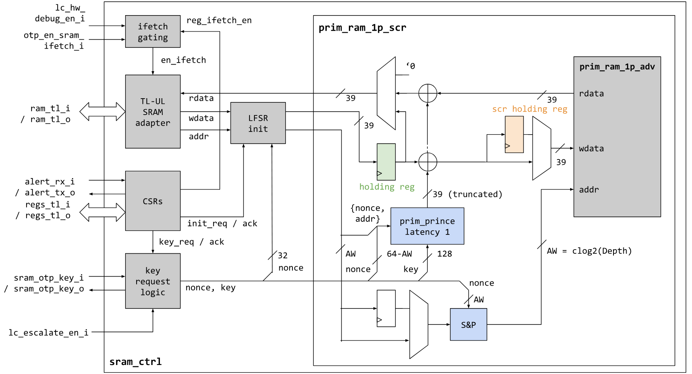
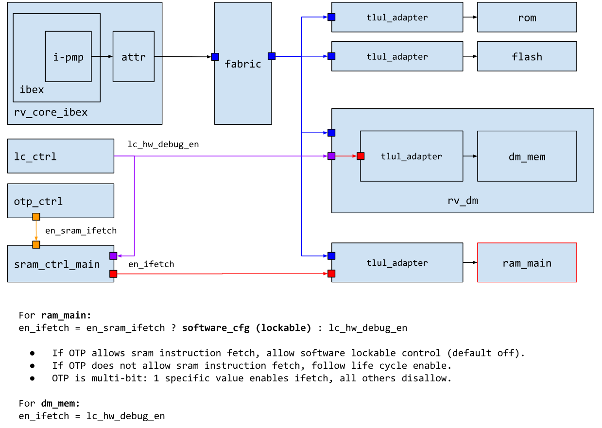
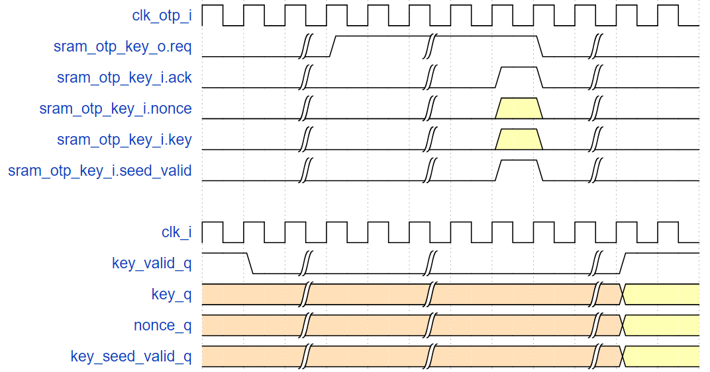
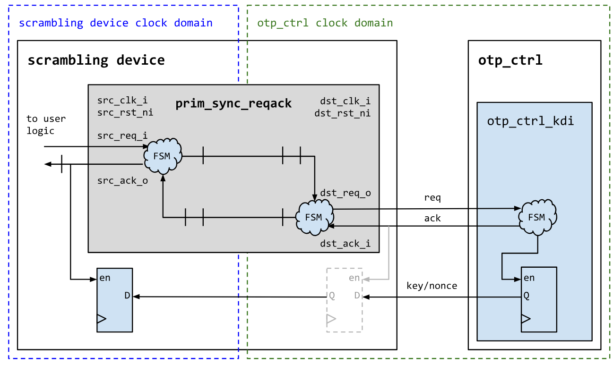

 
# 2.7 SRAM
## 2.7.1 SRAM Controller Technical Specification     

### Description

The SRAM controller incorporates the SRAM data and address scrambling device and provides CSRs for requesting the scrambling keys and triggering the hardware initialization feature. 
In the SRAM Controller of the hw platform, we added a Scramble module (acting on data and addr) and provided CSRs (used for requesting Scramble keys and triggering hardware initialization).
[This summary draws reference from the content of the OpenTitan Hard-Ware article.](https://opentitan.org/book/hw/ip/sram_ctrl/doc/theory_of_operation.html)
This is an interpretat**ion of the hw part of the sram_ctrl code.

### Features

- **Lightweight scrambling mechanism** based on the PRINCE cipher.
- Key request logic for the lightweight memory and address scrambling device.
- Alert sender and checking logic for detecting bus integrity failures.
- LFSR-based memory initialization feature.
- Access controls to allow / disallow code execution from SRAM.
- Security hardening when integrity error has been detected.

## 2.7.2 Theory of Operation

This section explains how the module controls external IRAM through software analysis.

  

 

       

The main structure is concentrated on the left side of the diagram, with a hardware instance application on the right.

It is mainly divided into the following parts:

- TL-UL SRAM Adapter;
- LFSR: Used for initialization (mechanism detailed in [1.2. Section](### 1.2. LFSR Initialization Mechanism));
- CSRs;
- Key request.

### How the Controller handles Integrity Errors

When encountering an **Integrity Error**, `sram_ctrl` will latch the integrity error and issue a `fatal_bus_integ_error` until the next reset (the generation of integrity errors is determined by system integration).

Additionally, the latched error condition is fed into the `prim_ram_1p_scr` primitive via a dedicated input, causing the scrambling primitive to perform the following actions:

- Invert the pseudorandom number used during address and CTR scrambling;
- Disable any transactions (read or write) to the actual memory macro.

###  LFSR Initialization Mechanism

Since the **Scramble device** uses a block cipher in CTR mode, from a security perspective, it is undesirable to initialize the memory to all zeros (this would leak the XOR keystream).

To avoid this, `sram_ctrl` includes an LFSR-based initialization mechanism that overwrites the entire memory with pseudo-random data.

Initialization can be triggered via the `CTRL.INIT` CSR. When initialization is triggered, the LFSR is first re-seeded using the obtained random number and the scrambling key. Then, the pseudo-random data extracted from the LFSR is used to initialize the memory.

For each pseudo-random 32-bit data, the initialization mechanism calculates the corresponding integrity bits and writes the data and integrity bits (a total of 39 bits) through the scrambling device using the most recently obtained scrambling key.

If the Scrambling Key update and LFSR initialization are triggered simultaneously on the software side (i.e., the software uses the same CSR write operation as the LFSR), the LFSR initialization will be halted until the updated Scrambling Key is obtained.

There is no limit on the frequency of calls to the initialization function, so it can also be used at runtime as a cheap SRAM erase mechanism. However, note that the PRNG sequence does not have strong security guarantees, as it is generated using an LFSR.

###  Executing Code via SRAM

>

The enable signal of the RAM ctrl is controlled by `otp_ctrl`;    
  

  

 

   

### Read and Write Sequences

Combining the original text, the timing requirements for read and write operations are as follows:

- For timing reasons, the scrambling primitive instantiates a register in the middle of the PRINCE block cipher;
- Write operations must be delayed by 1 cycle;
- Sub-word write accesses currently require read-modify-write operations to recalculate the integrity bits of the entire word.

## 2.7.3 Design Verification

The test plan objectives for the SRAM Controller (for dvsim) are as follows:

- Verify all SRAM_CTRL IP functionalities through dynamic simulations using SV/UVM-based test benches.
- Develop and run all tests according to the test plan to close code and functional coverage for the IP and all its submodules (excluding pre-verified submodules).
- Refer to the [OpenTitan SRAM CTRL test plan](https://opentitan.org/book/hw/ip/sram_ctrl/dv/index.html#top-level-testbench) for specific test cases.

### Programming Guide

For software-side operational procedures, refer to the [OpenTitan SRAM CTRL software debugging guide](https://opentitan.org/book/hw/ip/sram_ctrl/doc/programmers_guide.html).

## 2.7.4 Hardware Interfaces

This section includes parameters, signals, security signals, and handshake signal behavior with external modules (including OTP and Scramble devices). The **handshake signal behavior with external modules (including OTP and Scramble devices)** is also described in terms of software-side security measures.

### 2.7.4.1 Parameters

| Parameter | Default | Top Earlgrey | Description |
| :-----------: | :-----------: | :-----------: | :-----------: |
| `AlertAsyncOn` | 1'b1 | 1'b1 | |
| `InstrExec` | 1 | 1 | Enable execution from SRAM side |
| `MemSizeRam` | 4096 | (multiple values) | Number of 32-bit words in SRAM (overridable by topgen) |
| `RndCnstSramKey` | (see RTL) | (see RTL) | Random default constant for Scrambling Key at compile time |
| `RndCnstSramNonce` | (see RTL) | (see RTL) | Random default constant for Scrambling Nonce at compile time |
| `RndCnstLfsrSeed` | (see RTL) | (see RTL) | Random default constant for LFSR seed at compile time |
| `RndCnstLfsrPerm` | (see RTL) | (see RTL) | Random default constants for LFSR permutation at compile time |

### 2.7.4.2 External Signal Interfaces

The `sram_ctrl` module defines the following hardware interfaces:

- Main clock: `clk_i`
- Other clocks (OTP device): `clk_otp_i`
- Bus device interface (TL-UL): `regs_tl`, `ram_tl`
- Bus host interface (TL-UL): none
- Chip IO peripheral pins: none
- Interrupts: none

### 2.7.4.3 Internal Signal Interfaces

| Port Name | Package::Struct | Type | Act | Width | Description |
| :-----------: | :-----------:| :-----------: | :-----------: | :-----------: | :-----------: |
| `sram_otp_key` | `otp_ctrl_pkg::sram_otp_key` | `req_rsp` | `req` | 1 | |
| `cfg` | `prim_ram_1p_pkg::ram_1p_cfg` | `uni` | `rcv` | 1 | Routine signal cfg |
| `lc_escalate_en` | `lc_ctrl_pkg::lc_tx` | `uni` | `rcv` | 1 | Global and local upgrade enable |
| `lc_hw_debug_en` | `lc_ctrl_pkg::lc_tx` | `uni` | `rcv` | 1 | |
| `otp_en_sram_ifetch` | `prim_mubi_pkg::mubi8` | `uni` | `rcv` | 1 | |
| `regs_tl` | `tlul_pkg::tl` | `req_rsp` | `rsp` | 1 | |
| `ram_tl` | `tlul_pkg::tl` | `req_rsp` | `rsp` | 1 | |

### 2.7.4.4 Alert Signals

| Alert Name | Description |
| :----------- | :----------- |
| `fatal_error` | Triggered when a fatal TL-UL bus integrity failure or initialization mechanism reaches an invalid state. |

### 2.7.4.5 Safety Measures

| Countermeasure ID | Description |
| :-----------: | :-----------: |
| `SRAM_CTRL.BUS.INTEGRITY` | End-to-end bus integrity scheme. |
| `SRAM_CTRL.CTRL.CONFIG.REGWEN` | SRAM control registers are protected by REGWEN. |
| `SRAM_CTRL.EXEC.CONFIG.REGWEN` | SRAM execution enable register is protected by REGWEN. |
| `SRAM_CTRL.EXEC.CONFIG.MUBI` | SRAM execution enable register is multi-bit encoded. |
| `SRAM_CTRL.EXEC.INTERSIG.MUBI` | SRAM execution enable signal from OTP is multi-bit encoded. |
| `SRAM_CTRL.LC_ESCALATE_EN.INTERSIG.MUBI` | Life cycle escalation enable signal is multi-bit encoded. |
| `SRAM_CTRL.LC_HW_DEBUG_EN.INTERSIG.MUBI` | Life cycle hardware debug enable signal is multi-bit encoded. |
| `SRAM_CTRL.MEM.INTEGRITY` | End-to-end data/memory integrity scheme. |
| `SRAM_CTRL.MEM.SCRAMBLE` | Data is scrambled using a key-reduced round PRINCE cipher in CTR mode. |
| `SRAM_CTRL.ADDR.SCRAMBLE` | Addresses are scrambled using a keyed lightweight permutation/diffusion function. |
| `SRAM_CTRL.INSTR.BUS.LC_GATED` | Prevent code execution from SRAM during non-test lifecycle states. |
| `SRAM_CTRL.RAM_TL_LC_GATE.FSM.SPARSE` | Control FSM within TL-UL gating primitive is sparse encoded. |
| `SRAM_CTRL.KEY.GLOBAL_ESC` | Scrambling key and nonce are reset to fixed values during escalation, and bus transactions to memory are blocked. |
| `SRAM_CTRL.KEY.LOCAL_ESC` | Scrambling key and nonce are reset to fixed values during local escalation due to bus integrity or counter errors, and bus transactions to memory are blocked. |
| `SRAM_CTRL.INIT.CTR.REDUN` | Initialization counter is redundant. |
| `SRAM_CTRL.SCRAMBLE.KEY.SIDELOAD` | Scrambling key is sideloaded from OTP and cannot be read by software. |
| `SRAM_CTRL.TLUL_FIFO.CTR.REDUN` | TL-UL response FIFO pointers are implemented using redundant counters. |

#### 2.7.4.5.1 Interface between OTP and SRAM Scrambling Primitives

  

  

  

     

- The **key derivation interface within OTP CTRL (i.e., `sram_otp_key`)** follows a simple req/ack handshake protocol.
  1. SRAM CTRL requests an updated transient key by asserting `sram_otp_key_i.req`.
  2. The OTP controller obtains the `entropy` signal from CSRNG (refer to CSRNG in hw) and derives the transient key using the **SRAM_DATA_KEY_SEED** and **PRESENT** scrambling data path (as described in the OTP controller specification).
  3. The OTP controller returns a new transient key via the response channel (`sram_otp_key_o[*]`, `otbn_otp_key_o`), completing the req/ack handshake.
- The key and nonce are available for use by the scrambling primitives in subsequent cycles. The waveform diagram illustrates this process.
- If key seeds are not configured in OTP, keys are derived from all-zero constants, and the `*.seed_valid` signal is set to 0 in the response. Note that this mechanism requires CSRNG and the entropy distribution network to be operational. If they are not, the key derivation request is blocked.
- The req/ack protocol operates on `clk_otp_i`. SRAM CTRL synchronizes the data through the req/ack handshake primitive `prim_sync_reqack.sv`.

  
 

    

#### 2.7.4.5.2 Global and Local Upgrades

This section explains the functionality of `lc_escalate_en_i`:

The `lc_escalate_en_i` signal is responsible for initiating global and local upgrades. When this signal is asserted, it triggers the system to perform necessary actions to upgrade the SRAM Controller and its associated components. This includes updating the scrambling keys, resetting counters, and ensuring the integrity of bus transactions to prevent unauthorized access or errors during the upgrade process. Global upgrades affect the entire system, while local upgrades focus on specific components, ensuring a controlled and secure update mechanism.

## 2.7.5 Register

Detailed reading of 
[OpenTitan SRAM CTRL Register Configuration](https://opentitan.org/book/hw/ip/sram_ctrl/doc/registers.html),
here is the basic description.

Name | Offset | Length | Description
:-----------: | :-----------: | :-----------: | :-----------:
sram_ctrl.**ALERT_TEST** | 0x0 | 4 | Alert Test Register (1 bit for alert)
sram_ctrl.**STATUS** | 0x4 | 4 | SRAM Status Register (6 states; 1-bit thermal)
sram_ctrl.**EXEC_REGWEN** | 0x8 | 4 | Execution Enable Register Lock (EXEC's enable)
sram_ctrl.**EXEC** | 0xc | 4 | SRAM Execution Enable (4 bits, related to OTG function)
sram_ctrl.**CTRL_REGWEN** | 0x10 | 4 | Control Register Lock (CTRL's enable)
sram_ctrl.**CTRL** | 0x14 | 4 | SRAM Control Register (2 bits, related to OTG and LFSR control)
sram_ctrl.**SCR_KEY_ROTATED** | 0x18 | 4 | Clearable SRAM Key Request Status (4 bits, related to OTG function)

## 2.7.6 External Interface Function

`dif_sram_ctrl.h`

## 2.7.7 Checklist

Summary and design plan of the article. 
To understand the specific functional implementation of SRAM CTRL, it is necessary to read the **LFSR (CSRs)** and **OTP Controller** sections.